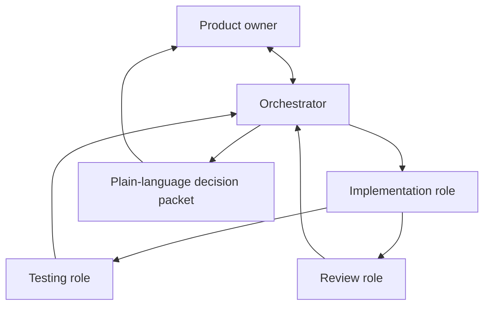

# Governed Multi-Agent Skill Suite

Version 1.2.3 — source distribution. Install only from a published versioned tag or release archive, not from a mutable branch.

This is a source distribution of 20 focused Codex skills for owner-governed software delivery. It is for technical users or authorized AI agents that can work with local project files, Git, Python 3, and Codex. It is not a one-click installation, a hosted service, or a universal ChatGPT web feature.

## Intended operating model



The skills instruct agents to use this workflow and the bundled validators check selected records and files. They do not create host-level access control, authenticate identities, prove that separate agents were used, or prevent a user from invoking a specialist directly.

- The orchestrator is the recommended owner-facing entry point.
- Each owner-visible work package is designed to have separate implementation, testing, and review roles.
- The raw suite can detect declared role overlap, but only a trusted host can attest that roles were performed by distinct principals. Otherwise, label the passes `separate-pass-not-independent`.
- Evidence records are expected to be fresh, contained, and traceable. A correction invalidates affected prior evidence.
- The orchestrator may recommend a technical decision; the owner remains responsible for the final business decision.
- A small or urgent request changes the amount of evidence, not the need to disclose limitations and follow the agreed workflow.

## Control boundary

The bundled validators recompute hashes from contained regular files, check canonical paths and UTC timestamps, reject bare evidence strings, and bind checked file descriptors before hashing. They deliberately fail closed for self-declared execution records: they cannot authenticate an arbitrary identity string, prove a declared command ran, or prove that two passes came from separate host agents. `--integrity-only` reports file and field consistency only; execution and identity attestation require a trusted host integration outside this suite.

The 19 specialist skills state that, without an orchestrator-issued assignment contract, they should provide only a read-only consultation. This is an instruction-level safeguard, not platform enforcement.

The repository includes ten fresh-context adversarial evaluation fixtures, all marked `not-run`. CI can validate that the fixtures are complete and do not fabricate a result; it is not evidence that a live agent behavior trial occurred. See [Evaluations](evaluations/README.md).

## Skills

The table describes the documented behavior. It does not turn an instruction into a host-enforced permission or an independent-attestation claim.

| # | Skill | Documented behavior |
| --- | --- | --- |
| 1 | `orchestrate-owner-governed-delivery` | Coordinates owner-facing governed work: clarifies the outcome, creates bounded packages, routes roles, reconciles evidence, and reports decisions in plain language. It cannot prevent direct specialist invocation. |
| 2 | `init-owner-governance` | Sets up a project constitution, templates, adapters, evidence records, and governance checks under an authorized assignment. |
| 3 | `shape-feature-foundation` | Investigates and challenges a proposed change before a specification or implementation is drafted. |
| 4 | `design-human-centered-experience` | Defines accessible, ethical, low-friction journeys and interaction requirements before implementation. |
| 5 | `specify-approved-change` | Turns a reviewed Foundation into testable requirements, acceptance criteria, and explicit exclusions. |
| 6 | `architect-system-deliberately` | Records proportional architecture decisions using the inspected system, constraints, and trade-offs. |
| 7 | `plan-governed-implementation` | Produces ordered, owned work packages with evidence requirements and dependencies. |
| 8 | `guard-approved-artifacts` | Checks declared inputs, fingerprints, scope boundaries, and authorization records before execution. |
| 9 | `prepare-safe-workspace` | Establishes a reproducible workspace baseline before changing files. |
| 10 | `execute-approved-work` | Delivers one authorized work package, preserves scope boundaries, and returns implementation evidence. |
| 11 | `engineer-backend-and-data` | Implements or inspects APIs, data behavior, authorization, transactions, migrations, and jobs within an assignment. |
| 12 | `engineer-frontend-accessibly` | Implements or inspects accessible, responsive, localized client-side behavior within an assignment. |
| 13 | `develop-test-first` | Uses a proportionate red-green-refactor cycle or characterization tests for behavioral changes. |
| 14 | `debug-from-root-cause` | Investigates defects with reproducible evidence and applies the smallest verified correction. |
| 15 | `assure-quality-systematically` | Defines and performs a separately assigned QA role covering requirements, boundaries, failures, permissions, and regressions. |
| 16 | `secure-and-protect-system` | Performs a separately assigned assessment of security, privacy, authorization, abuse, and sensitive-data risks. |
| 17 | `engineer-performance-and-reliability` | Assesses performance, capacity, observability, resiliency, and recovery needs. |
| 18 | `review-governed-change` | Performs a separately assigned code-and-intent review; it is distinct from testing and does not itself accept work. |
| 19 | `verify-implementation` | Recomputes and checks provenance, freshness, traceability, declared identities, and unresolved claims before an acceptance recommendation. |
| 20 | `verify-production-release` | Checks release readiness, deployment authorization records, rollback safety, and post-release verification. It cannot enforce GitHub settings or deploy a release. |

## Repository layout

```text
skills/       # The 20 portable skills, each with SKILL.md and required resources
docs/         # Foundation design reference, release notes, and integrity documents
scripts/      # Deterministic validators and the repository-scope installer
tests/        # No-dependency regression tests
.github/      # GitHub Actions validation workflow
INSTALL.md    # Supported local installation and verification guide
```

The individual skill directories contain only portable skill resources: `SKILL.md`, `agents/openai.yaml`, and any required scripts, references, or assets.

## Use

For governed work, explicitly invoke the orchestrator:

```text
$orchestrate-owner-governed-delivery I want to …
```

It should first discuss the outcome and decision with the owner. It then routes bounded work and reports the evidence and limitations. Do not describe testing or review as independent unless the host has attested distinct principals.

## Install

Read [INSTALL.md](INSTALL.md) before copying anything. The supported route is a verified, versioned source checkout installed into an empty repository-scoped `.agents/skills` directory by the included installer. The guide is intentionally for technical users and authorized agents, not ordinary ChatGPT web users.

Standalone skills are available in the ChatGPT desktop app, Codex CLI, and the Codex IDE extension where the feature is enabled. This repository is **not a plugin**: raw `skills/` folders cannot be installed directly into ChatGPT Work on the web. Wider distribution through ChatGPT web requires a separately packaged and permitted plugin. Availability depends on plan, platform, and workspace or machine administrator controls described in the [official skills documentation](https://learn.chatgpt.com/docs/build-skills).

## Validate

Use a POSIX-compatible Python 3 environment (Linux, macOS, or WSL) for the full integrity checks. The descriptor-safe validators in this release do not support native Windows verification.

```bash
python3 scripts/release_checksums.py
python3 scripts/validate_suite.py
python3 scripts/validate_evaluation_suite.py
python3 -m unittest discover -s tests -p 'test_*.py' -v
python3 -m compileall -q scripts skills
```

Never add `--write` to the first command when verifying a downloaded release. That flag is reserved for the release maintainer when deliberately rebuilding the checksum inventory; see [Release Integrity](docs/RELEASE_INTEGRITY.md).

## Release selection

Install only from a published versioned tag or release archive, never directly from `main`. A matching GitHub tag and Release page establish publication; this source file does not assert whether any particular tag has been published. Follow the maintainer-only sequence in [Release Integrity](docs/RELEASE_INTEGRITY.md) before creating a new tag. A GitHub repository or tag is a source-distribution mechanism; it does not automatically install or attest the skills.

See the [v1.2.3 release notes](docs/RELEASE_NOTES_v1.2.3.md) for the correction that makes this source documentation safe to publish.

## Scope

This is a universal engineering-governance suite. It deliberately contains no EduSight database, spreadsheet, policy, or application source material.

## License

Licensed under the [Apache License 2.0](LICENSE).
